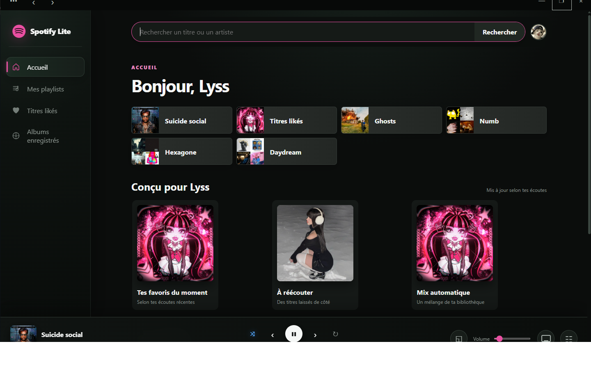
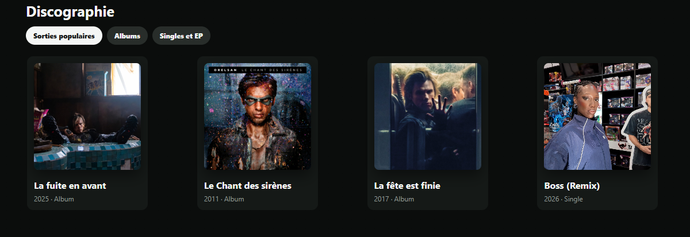

# Spotify Lite

Client Spotify non officiel pour Windows, pense comme une version plus legere, plus directe et plus personnelle de Spotify Desktop.

> Ce projet n'est pas affilie a Spotify AB. Il utilise les API publiques Spotify et OAuth PKCE. La lecture complete necessite un compte Spotify Premium.

<p align="center">
  
</p>

## Apercu

Spotify Lite garde l'essentiel : une interface sombre/rose, une vraie fenetre Windows, la lecture Spotify Connect, la recherche, les pages artistes/albums/playlists et une bibliotheque simple a parcourir.

<p align="center">
  
</p>

<p align="center">
  
</p>

## Fonctionnalites

- Application Windows autonome via WebView2, sans ouverture d'un onglet navigateur.
- Connexion Spotify avec OAuth PKCE, sans Client Secret dans l'application.
- Lecture, pause, suivant, precedent, aleatoire, repetition et volume persistant.
- Recherche Spotify avec resultats artistes, titres, albums et playlists.
- Pages artistes, albums, playlists, profil, titres likes et bibliotheque.
- Creation de playlists sur le vrai compte Spotify.
- Theme sombre/rose, mini-lecteur, file d'attente et raccourcis clavier.

## Tuto rapide

### 1. Creer une app Spotify

1. Va sur le [Spotify Developer Dashboard](https://developer.spotify.com/dashboard).
2. Cree une nouvelle app.
3. Copie le `Client ID`.
4. Ajoute cette Redirect URI exactement :

```text
http://127.0.0.1:43821/callback
```

### 2. Configurer Spotify Lite

Copie `config.example.js` vers `config.js`, puis remplace `YOUR_SPOTIFY_CLIENT_ID`.

```js
globalThis.SPOTIFY_LITE_CONFIG = {
  clientId: "YOUR_SPOTIFY_CLIENT_ID",
  redirectUri: "http://127.0.0.1:43821/callback"
};
```

`config.js` est ignore par Git. Tu peux donc mettre ton Client ID localement sans le publier.

### 3. Lancer en developpement

Installe Node.js 20 ou plus, puis lance :

```bash
npm run dev
```

Ouvre ensuite :

```text
http://127.0.0.1:43821
```

### 4. Compiler l'application Windows

Depuis PowerShell :

```powershell
npm run build:windows
```

Le premier build telecharge automatiquement le SDK WebView2 depuis NuGet.

L'application compilee est creee ici :

```text
dist/Spotify Lite/Spotify Lite.exe
```

Une archive prete a partager est aussi generee :

```text
dist/Spotify-Lite-Windows.zip
```

## Prerequis

- Windows 10 ou 11.
- Microsoft Edge WebView2 Runtime installe.
- Node.js 20+ pour le mode developpement.
- Un compte Spotify Premium pour la lecture via l'API Web Playback.

## Raccourcis

- `Espace` : lecture / pause
- `Fleche gauche` / `Fleche droite` : precedent / suivant
- `S` : lecture aleatoire
- `R` : repetition
- `M` : mini-lecteur

## Publier sur GitHub

Le depot est prepare pour ne publier que le code source :

- `config.js` reste local.
- `dist/` reste local.
- GitHub Actions peut verifier le JavaScript et construire l'application Windows.

Commandes de base :

```bash
git commit -m "Initial Spotify Lite release"
git remote add origin https://github.com/TON-NOM/spotify-lite.git
git push -u origin main
```

## Donnees locales

La connexion Spotify, les preferences et les images personnalisees restent dans le profil local WebView2 de l'utilisateur. Aucun Client Secret n'est necessaire.

## Licence

MIT
